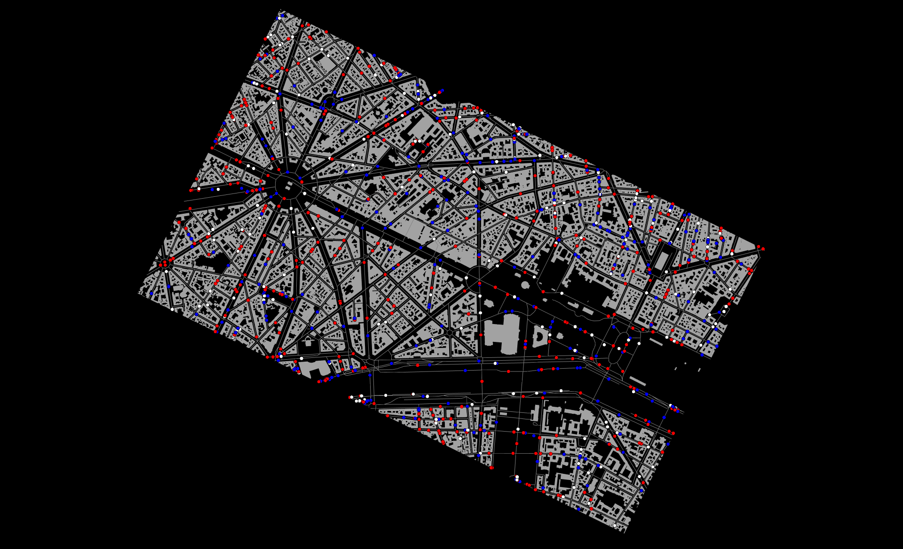

# ReChamp
Project for the Champs Elysées project



## GAMA 
Located in the ```` ReChamp_Gama ```` folder this is the GAMA ABM model developped for the exhibition and running on the physcial CityScope in Paris.

## Web Visualization
Located in ```` champscope ````
Work in progress to propose a virutal 3D immersive envrionment on the CityScope table 

**MIT Team**

Arnaud Grignard, Nicolas Ayoub, Kent Larson

Collaborating Researcher: Luis Alonso, Ariel Noyman, Markus Elkatsha

**Gama Team**

Tri Nguyen-Huu, Patrick Taillandier, Alexis Drogoul

**PCA Team**

Yan Roche, Philippe Chiambaretta

